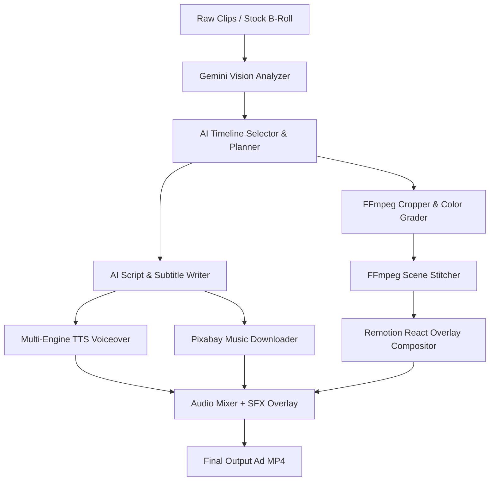

<p align="center">
  
</p>

<h1 align="center">AdForge</h1>

<p align="center"><strong>The open-source, local-first video ad production pipeline powered by Gemini & Remotion.</strong></p>

<p align="center">
  <a href="LICENSE"></a>
  
  
  
</p>

---

AdForge is a production-grade, local-first pipeline designed to convert raw footage folder dumps into polished social media video ads in seconds. It handles video analysis, scriptwriting, voiceover synthesis, color grading, music overlays, sound effects, and animated lower-thirds automatically.

Unlike typical video generation scripts, AdForge uses **Remotion** under the hood, enabling it to render background footage and React-animated subtitles, lower-thirds, and CTAs in a single, high-fidelity browser compositing pass.

---

## 🚀 Key Features

*   **🎬 Multi-Modal Video Analysis**: Uses Gemini 2.5 Flash to index raw clips, score energy/action levels, and detect optimal start/end cut times.
*   **🌐 Automated B-Roll Sourcing**: Generates ads without uploading any clips. Automatically queries and downloads high-quality stock videos from Pexels, Pixabay, or scrapers.
*   **🎙️ Pluggable Voice Synthesis (TTS)**: Synthesizes narration across multiple engines — Google Cloud Journey voices, free EdgeTTS cloud neural voices (no API key required), local offline pyttsx3, or OpenAI TTS — with automatic failover.
*   **🤖 Multi-Provider LLM Manager**: Swap between Gemini 2.5 Flash, GPT-4o, Claude 3.5 Sonnet, or local Ollama models from a single dropdown.
*   **✍️ AI Copywriter**: Generates engaging voiceover scripts, titles, and CTA actions mapped directly to segment durations.
*   **📐 Smart Aspect Ratio Resizer**: Toggle between **Vertical (9:16)**, **Horizontal (16:9)**, and **Square (1:1)** formats with automatic crop/scale and matching Remotion overlay compositions.
*   **🎨 Visual Theme Stylizer**: Custom primary & accent color pickers and brand font selector (Space Grotesk, Inter, Georgia, Courier New) that propagate into React overlay renders.
*   **🎭 React-Based Overlays (Remotion)**: Headless rendering of intro hook titles, lower-thirds, active karaoke captions, and CTA end cards directly on top of the timeline.
*   **💥 Dynamic Sound Effects (SFX)**: Synchronized transition whoosh sounds at scene cuts and pop sounds at title reveals, mixed into the final audio track.
*   **🎵 Smart Audio Mixer**: Searches Pixabay for free commercial background tracks or uses uploaded custom audio, with sidechain-ducking and configurable volume sliders.
*   **🖥️ Web Campaign Studio**: Full visual dashboard with drag-and-drop uploads, editable script/timeline panels, cinematic transition selectors (glitch, crossfade, slide), and a Sandbox Assets Explorer to play/download/delete previous renders.

---

## 🗺️ Architectural Workflow



---

## 📦 Installation & Setup

### Prerequisites
Make sure you have these installed globally:
- **Python 3.8+**
- **FFmpeg & FFprobe**
- **Node.js 18+**

### 1. Clone the project
```bash
git clone https://github.com/HamzaSbay/AdForge.git
cd AdForge
```

### 2. Install Python dependencies
```bash
python -m venv .venv
source .venv/bin/activate  # On Windows: .venv\Scripts\activate
pip install -r requirements.txt
```

### 3. Setup Remotion Node modules
Navigate to the OpenMontage folder and initialize the composer modules:
```bash
cd ../OpenMontage/remotion-composer
npm install
```

---

## ⚙️ Configuration

### Environment Variables (`.env`)
Copy `.env.example` to `.env` and add your API keys:
```bash
GOOGLE_API_KEY=your_gemini_api_key        # Required for Gemini vision analysis & scriptwriting
OPENAI_API_KEY=your_openai_key            # Optional — for GPT-4o or OpenAI TTS
ANTHROPIC_API_KEY=your_anthropic_key      # Optional — for Claude 3.5 Sonnet
PEXELS_API_KEY=your_pexels_key            # Optional — for stock B-roll sourcing
```

### Pipeline Settings (`config.yaml`)
Customize all campaign, grading, and rendering constants:

```yaml
video:
  target_width: 1080
  target_height: 1920
  fps: 30
  codec: "libx264"
  audio_codec: "aac"
  sharpen_filter: "unsharp=3:3:0.5:3:3:0.5"

audio:
  video_volume: 0.08      # ducked background audio
  narration_volume: 1.15   # speech boost
  music_volume: 0.08      # music mix level

tts:
  default_voice: "en-US-Journey-D"
  local_fallback_rate: 185 # SAPI5 speaking rate
```

---

## 🏃 Running the Application

1. Start the FastAPI local server:
   ```bash
   uvicorn app:app --reload
   ```
2. Open your browser and navigate to **`http://127.0.0.1:8000`** to access the AdForge Studio dashboard.
3. Drag in your raw clips (or leave empty to use automated B-roll sourcing), specify your product campaign brief, and click **Analyze Clips & Draft Plan**!

---

## 🧪 Testing

Run the full test suite:
```bash
pytest -v
```

All 11 tests cover:
- Clip analyzer fallback behavior
- Full pipeline orchestration flow
- Draft bypass (pre-approved script/timeline) flow
- Advanced parameter propagation (aspect ratios, colors, fonts, volumes)
- TTS engine auto-failover (Google → Edge → pyttsx3)
- Scriptwriter offline brand/theme generation
- Timeline selector duration targeting
- Stock video query generation and download fallback

---

## 📁 Project Structure

```
AdForge/
├── app.py                  # FastAPI web server + SSE streaming
├── main.py                 # CLI entrypoint
├── config.yaml             # Pipeline configuration
├── pipeline/
│   ├── orchestrator.py     # 12-step production pipeline coordinator
│   ├── analyzer.py         # Gemini multi-modal clip analysis
│   ├── selector.py         # AI timeline cuts planner
│   ├── scriptwriter.py     # AI copywriter & overlay titles
│   ├── narrator.py         # TTS voiceover with per-paragraph alignment
│   ├── tts.py              # Multi-engine TTS manager (Google/Edge/pyttsx3/OpenAI)
│   ├── llm.py              # Multi-provider LLM manager (Gemini/GPT/Claude/Ollama)
│   ├── music.py            # Pixabay music search & download
│   ├── stockvideo.py       # Automated B-roll stock video sourcing
│   ├── colorgrader.py      # FFmpeg crop, scale, LUT grading (9:16/16:9/1:1)
│   ├── editor.py           # FFmpeg trim & stitch
│   ├── mixer.py            # Audio ducking mixer + SFX overlay
│   ├── renderer.py         # Remotion headless React overlay compiler
│   └── config.py           # YAML config loader
├── static/
│   ├── index.html          # Campaign studio web dashboard
│   ├── logo.png            # AdForge logo
│   └── sfx/                # Synthesized sound effects (whoosh, pop)
├── tests/                  # pytest unit & integration tests
├── luts/                   # 3D LUT color grading files
├── docs/                   # Architecture documentation
└── .github/                # CI workflow, issue & PR templates
```

---

## 🤝 Contributing

Contributions are welcome! Please read [CONTRIBUTING.md](CONTRIBUTING.md) for guidelines on submitting issues, feature requests, and pull requests.

---

## ⚖️ License
This project is licensed under the MIT License - see the [LICENSE](LICENSE) file for details.
