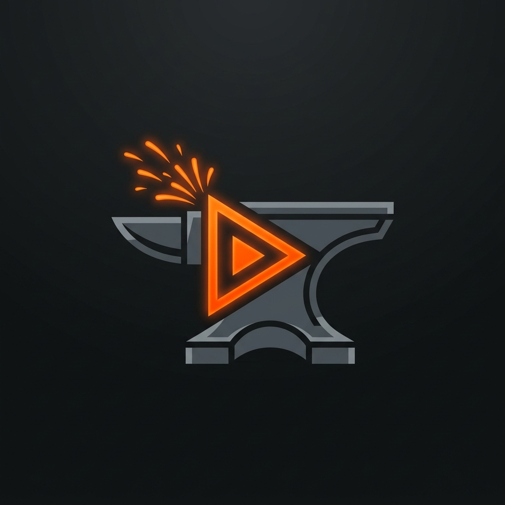
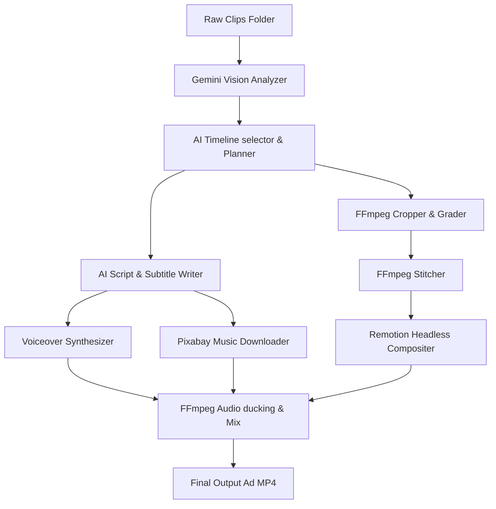

<p align="center">
  
</p>

<h1 align="center">AdForge</h1>

<p align="center"><strong>The open-source, local-first video ad production pipeline powered by Gemini & Remotion.</strong></p>

<p align="center">
  <a href="LICENSE"></a>
  
  
</p>

---

AdForge is a production-grade, local-first pipeline designed to convert raw footage folder dumps into polished vertical (9:16) social media video ads in seconds. It handles video analysis, scriptwriting, voiceover synthesis, color grading, music overlays, and animated lower-thirds automatically.

Unlike typical video generation scripts, AdForge uses **Remotion** under the hood, enabling it to render background footage and React-animated subtitles, lower-thirds, and CTAs in a single, high-fidelity browser compositing pass.

---

## 🚀 Key Features

*   **🎬 Multi-Modal Video Analysis**: Uses Gemini 2.5 Flash to index raw clips, score energy/action levels, and detect optimal start/end cut times.
*   **🌐 Automated B-Roll Sourcing (Stock Video Finder)**: Enables generating ads without uploading any clips. Automatically queries and downloads high-quality portrait stock videos from Pexels, Pixabay, or scrapers.
*   **🎙️ Pluggable Voice Synthesis (TTS)**: Synthesizes narration across multiple engines (Google Cloud Journey voices, free EdgeTTS cloud neural voices requiring no API keys, local offline pyttsx3, or OpenAI TTS).
*   **✍️ AI Copywriter**: Generates engaging voiceover scripts, titles, and CTA actions mapped directly to segment durations.
*   **🎨 Dynamic reframing & grading**: Centering & reframing horizontal (16:9) or vertical footage into target crops, applying custom LUT overlays and sharpening.
*   **🎭 React-Based Overlays (Remotion)**: Headless rendering of titles, lower-thirds, active karaoke captions, and CTA cards directly on top of the timeline.
*   **🎵 Smart Audio Mixer**: Searches Pixabay for free commercial background tracks or uses uploaded custom audio, automatically sidechain-ducking music volume during voiceovers.
*   **🖥️ Web Campaign Studio**: Full visual dashboard to customize transitions (glitch, crossfade, slide), adjust volume levels, re-order scene timeline cuts, upload custom music tracks, and delete/play previously rendered ads in the Sandbox Assets Explorer.

---

## 🗺️ Architectural Workflow



---

## 📦 Installation & Setup

### Prerequisites
Make sure you have these installed globally:
- **Python 3.8+**
- **FFmpeg & FFprobe**
- **Node.js 18+**

### 1. Clone the project
```bash
git clone https://github.com/HamzaSbay/AdForge.git
cd AdForge
```

### 2. Install Python dependencies
```bash
python -m venv .venv
source .venv/bin/activate  # On Windows: .venv\Scripts\activate
pip install -r requirements.txt
```

### 3. Setup Remotion Node modules
Navigate to the OpenMontage folder and initialize the composer modules:
```bash
cd ../OpenMontage/remotion-composer
npm install
```

---

## ⚙️ Configuration (`config.yaml`)

Customize all campaign, grading, and rendering constants inside `config.yaml`:

```yaml
video:
  target_width: 1080
  target_height: 1920
  fps: 30
  codec: "libx264"
  audio_codec: "aac"
  sharpen_filter: "unsharp=3:3:0.5:3:3:0.5"

audio:
  video_volume: 0.08      # ducked background audio
  narration_volume: 1.15   # speech boost
  music_volume: 0.08      # music mix level

tts:
  default_voice: "en-US-Journey-D"
  local_fallback_rate: 185 # SAPI5 speaking rate
```

---

## 🏃 Running the Application

1. Configure your environment variables in `.env` (copy `.env.example` to `.env`):
   ```bash
   GOOGLE_API_KEY=your_gemini_api_key
   ```
2. Start the FastAPI local server:
   ```bash
   uvicorn app:app --reload
   ```
3. Open your browser and navigate to **`http://127.0.0.1:8000`** to access the AdForge Studio visual dashboard. Drag in your raw clips, specify your product campaign brief, and click **Produce Ad Campaign**!

---

## ⚖️ License
This project is licensed under the MIT License - see the [LICENSE](LICENSE) file for details.
